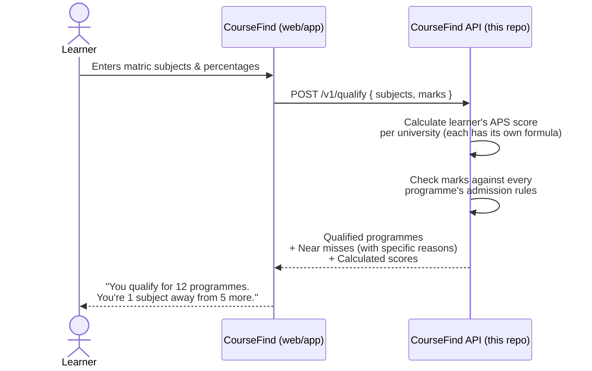
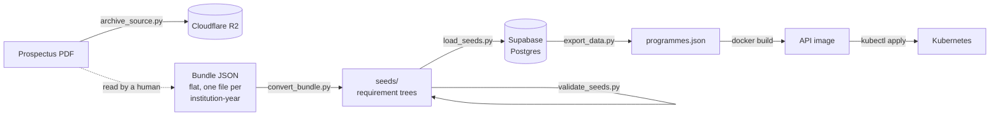

# CourseFind Data

**CourseFind answers one question for a South African matric learner: "which university programmes do I actually qualify for, right now, with the marks I have?"**

You type in your subjects and percentages. CourseFind checks them against every university programme it knows about and tells you exactly which ones you qualify for — and for the ones you *just* miss, exactly what's holding you back (e.g. "you need Mathematics level 5, you have level 4").

This repository is the data and API side of CourseFind: the service that does the checking, the admission-rules data it checks against, and the tooling that gets that data in and out.

---

## How it works (user flow)



The API is intentionally simple: on startup it loads the full programme dataset into memory once, and every request after that is pure in-memory checking — no database calls per request, which is why it can answer instantly even when checking thousands of programmes.

---

## Architecture

Admission requirements are **transcribed by hand** from prospectus PDFs into a flat JSON *bundle*, then converted, validated, stored, exported and shipped inside the API image.



Each step exists for a reason:

| Step | What it is for |
|---|---|
| **R2 archive** | The source PDF is stored so every record's `source_doc` + `source_page` resolves to a real page of a real document. When a learner disputes a result, pointing at the source page is what settles it. |
| **Bundle** | A person transcribes what the table *looks like* — one number per cell. Nobody hand-authors rule trees. |
| **convert_bundle.py** | Turns the flat shape into requirement trees, deriving the structure (`any` nodes, exclusions) the flat shape only implies. |
| **validate_data.py** | Structural checks *and* semantic ones — the errors hand-typed data actually contains. It reports; it never repairs. |
| **Postgres** | Source of truth. Holds every academic year; the API only ever sees the exported slice. |
| **export_data.py** | Flattens the chosen years into one JSON file. |
| **Docker + k8s** | The API ships as an image with the dataset baked in, so a running container needs no database at all. |

---

## Tech stack

| Layer | Technology | Why |
|---|---|---|
| API service | **FastAPI** + **Pydantic v2**, Python 3.12 | Fast to write, validates data automatically, great for a small JSON API |
| Server | **uvicorn** | The actual process that runs the FastAPI app |
| Package/dependency management | **uv** | Single fast tool for Python versions, virtual envs, and dependencies (a `uv workspace` ties `api/` and the root project together) |
| Database (source of truth) | **Supabase** (hosted Postgres) | Where verified programme data lives before being exported to the API's flat file |
| File/blob storage | **Cloudflare R2** | Stores the original prospectus PDFs the data was transcribed from |
| Prospectus acquisition | **requests** + **BeautifulSoup**, **pdfplumber** | Finding, downloading and triaging candidate prospectus PDFs |
| Testing | **pytest** | Both the API and the data tooling have their own test suites |
| Containerisation | **Docker** | The API ships as a container image |
| Deployment target | **Kubernetes** (`k8s/`, developed against a local **k3d** cluster) | Runs the API with health checks, resource limits, and horizontal scaling |

No AI/vision provider is involved anywhere in the data path. See [What was removed](#what-was-removed-and-why).

---

## Folder structure

<details>
<summary><strong>Click to expand the full folder layout</strong></summary>

```
coursefind-data/
├── api/                        # The live FastAPI service (what actually runs in production)
│   ├── src/app/
│   │   ├── main.py             # Web layer: routes, request/response shapes
│   │   ├── evaluator.py        # Core logic: does a learner meet ONE requirement?
│   │   ├── qualify.py          # Picks the right APS threshold for a learner
│   │   ├── scoring.py          # Per-university APS scoring formulas
│   │   ├── subjects.py         # Fixed list of matric subjects + level conversion
│   │   └── data/
│   │       └── programmes.json # The exported dataset the API loads at startup
│   ├── tests/                  # API test suite
│   └── Dockerfile
│
├── scripts/                    # The data pipeline, as CLI tools
│   ├── convert_bundle.py       # Flat bundle  ->  requirement trees in seeds/
│   ├── validate_data.py        # Structural + semantic validation (reports, never repairs)
│   ├── validate_seeds.py       # Runs the validator over seeds/, reporting file:line
│   ├── watch_seeds.py          # Re-validates on every save, for a live authoring loop
│   ├── seed_stats.py           # Encoding burn-down per faculty file
│   ├── load_seeds.py           # seeds/  ->  Postgres
│   ├── export_data.py          # Postgres  ->  api/src/app/data/programmes.json
│   ├── archive_source.py       # Source PDF  ->  R2, prints the key for source.document
│   ├── discover_prospectuses.py / fetch_prospectuses.py   # Find and download source PDFs
│   └── triage_prospectus.py    # Is this PDF a real prospectus or a brochure?
│
├── extract/                    # What survives of the old pipeline: acquisition + storage only
│   ├── sources/                # Two aggregator-site adapters + a shared HTTP/download helper
│   ├── institution_map.py      # Explicit name -> institution_id map for all 26 universities
│   └── storage.py              # Cloudflare R2 (S3-compatible) client
│
├── seeds/                      # The dataset, as requirement trees (one JSON per faculty/year)
│   ├── institutions.json       # Institution list + per-institution APS scoring strategy
│   ├── programme.schema.json   # JSON Schema for the tree shape (what seeds/ files are)
│   ├── bundle.schema.json      # JSON Schema for the FLAT shape (what you type)
│   └── uj/                     # University of Johannesburg — the one fully verified institution
│
├── tools/
│   └── uj_extract.py           # Standalone UJ-only PDF reader, kept as a cross-check
│
├── tests/                      # Tests for the data tooling (not the API — see api/tests)
├── supabase/migrations/        # Database schema
├── k8s/                        # Kubernetes manifests (deployment, service, autoscaling)
├── docs/
│   └── BUNDLE_FORMAT.md        # The flat format, in full, with a worked example
└── data/                       # Local working data: downloaded PDFs, discovery results (gitignored)
```

</details>

---

## Adding an institution

The whole operator flow, start to finish.

### 1. Find and download the prospectus

```bash
uv run python scripts/discover_prospectuses.py --year 2027
uv run python scripts/fetch_prospectuses.py --year 2027
```

### 2. Check it is worth transcribing

```bash
uv run python scripts/triage_prospectus.py --dir data/downloads
```

This separates a real prospectus (many per-programme requirement tables) from a summary brochure. It is not optional: CPUT's 15-page file contains exactly **two** real tables and TUT's contains **zero** qualification codes, and both look like full prospectuses until you read them page by page. Transcribing a brochure produces nothing.

### 3. Archive the source document

```bash
uv run python scripts/archive_source.py --institution uj --year 2027 \
    --pdf data/downloads/uj_2027.pdf
```

Keep the key it prints — it goes in the bundle's `source.document`, and is what makes every record's provenance resolvable later.

### 4. Transcribe it into a bundle

Read [`docs/BUNDLE_FORMAT.md`](docs/BUNDLE_FORMAT.md) first, then write one JSON file per institution-year with `seeds/bundle.schema.json` wired into your editor so it validates as you type.

The one thing to get right: **`"not_accepted"` is the opposite of an omitted key**, and the printed table often renders both as a dash. `"not_accepted"` bars a learner who offers the subject; `null` or an omitted key does nothing at all. Only a human reading the sentence under the table can tell which — that is precisely the judgement this architecture is built around.

### 5. Convert, and let the validator argue with you

```bash
uv run python scripts/convert_bundle.py bundles/uj_2027.json --dry-run   # check
uv run python scripts/convert_bundle.py bundles/uj_2027.json             # write seeds/
uv run python scripts/validate_seeds.py
```

`--dry-run` converts and validates without writing anything. Errors come back as `file:line`.

### 6. Load, export, ship

```bash
uv run python scripts/load_seeds.py
uv run python scripts/export_data.py --years 2027
cd api && docker build -t coursefind-api:2027.1 --build-arg DATA_VERSION=2027.1 .
kubectl apply -f k8s/
```

The image is tagged `year.revision`. The dataset is baked in at build time, so a running container reads no database and no PDF — only the JSON file inside itself.

---

## Validation

`scripts/validate_data.py` runs two layers, and neither ever modifies the data.

**Structural** — is the requirement tree well-formed? Unknown subject slugs, empty `all`/`any` nodes, a node setting both `subject` and `language`, levels outside 1–7.

**Semantic** — is the record well-formed *and still wrong*? These catch what hand-typed data actually gets wrong:

- a duplicate `qualification_code` within one institution-year
- Mathematical Literacy required at a *lower* level than Mathematics (the columns are swapped — Maths Lit is the easier subject)
- a non-extended Science Physics major asking for less than level 5 Physical Sciences (a row-offset transposition)
- any achievement level outside 1–7 — most often a percentage typed where a level belongs
- an APS outside 15–45
- no English requirement
- no `duration_years`

The motivating case: the hand-built dataset had **D2ACXQ and D2BTEQ with their APS values swapped, across two revisions**. Schema validation passes that without complaint — both are integers, both in range, both in the right field. Only a check that knows what the numbers *mean* catches it.

> **Validators report. They never repair.** An earlier version of the Physics check silently rewrote `physical_science` to 5 whenever a programme name contained "Physics". That laundered a transposition into plausible-looking bad data instead of surfacing it. A wrong record that looks right is worse than one that fails loudly.

---

## Environment variables

<details>
<summary><strong>Click to expand</strong></summary>

### Running the API

| Variable | Required? | Purpose |
|---|---|---|
| `PROGRAMMES_DATA_PATH` | No — defaults to the bundled `data/programmes.json` | Overrides where the API loads programme data from |
| `DATA_VERSION` | No — defaults to `"unknown"` | Stamped into every response's `X-Data-Version` header; set at Docker build time so you can tell which dataset a running container is serving |

### Running the data tooling

| Variable | Purpose |
|---|---|
| `DATABASE_URL` | Postgres connection string (Supabase) — where verified programme data is stored and loaded from |
| `R2_ACCOUNT_ID`, `R2_ACCESS_KEY_ID`, `R2_SECRET_ACCESS_KEY`, `R2_BUCKET`, `R2_ENDPOINT` | Cloudflare R2 credentials — where source prospectus PDFs are archived |

None of these are needed to run the API itself — the API only ever reads the already-exported `programmes.json` file, never the database, R2, or a PDF.

</details>

---

## Getting started

This project uses **[uv](https://docs.astral.sh/uv/)**.

```bash
uv sync                      # install the whole workspace (api/ + data tooling)

cd api
uv run uvicorn app.main:app --reload
# → http://127.0.0.1:8000/v1/meta

uv run pytest                # API test suite
cd .. && uv run pytest       # data tooling test suite
```

Some tests need infrastructure and are marked so they can be skipped:

```bash
uv run pytest -m "not db and not docker and not r2 and not slow"
```

`db` needs a reachable `DATABASE_URL`, `docker` builds and runs the real image, `r2` touches live Cloudflare, and `slow` reads real prospectus PDFs that may not exist on a fresh clone.

---

## What was removed, and why

This repository used to contain a general-purpose pipeline that read admission requirements out of arbitrary prospectus PDFs automatically. **It was deleted deliberately.** Everything is recoverable from git history — but before rebuilding any of it, read this.

**What it was.** Three independent extraction methods voted against each other: `textlayer.py` (text-position clustering), `geometric.py` (pdfplumber table detection) and `vision.py` (an AI vision model, via AI Studio / OpenRouter / Z.ai). A fourth coordinate-based method and a DUT-specific module were added later. Around them sat page classification, rotated-text repair, per-institution layout profiles (`registry.json`), footnote resolution, a reconciler, an OCR cache, an accuracy self-test gate, an inbox watcher and an `ingestions` tracking table.

**Why it went.**

1. **It never generalised past one document.** Every method was tuned against the UJ prospectus. Method D produced 12 garbage records on DUT and required a whole separate DUT-specific module to get anywhere. Each new institution meant a new layout profile hand-derived from the PDF — the same reading work as transcribing it, with an extra layer of machinery on top.
2. **UJ was the only ground truth.** Classification recall was gated against UJ and nothing else, so a passing UJ number was quietly standing in for "this generalises". It didn't. A missed page produces no record, no error and no warning — a learner simply never sees a programme they qualify for.
3. **The hard cases were never mechanical.** "Not accepted" vs "Not applicable" render identically on the page. The pipeline could not distinguish them and needed a hand-maintained per-code correction overlay to restore the difference — and some of those corrections turned out to be wrong and would have *deleted* correctly-read data. A human reading the sentence under the table gets it right the first time.
4. **The cost was inverted.** For the effort of profiling, running, reconciling and hand-verifying one institution, you can transcribe it. The verification pass was unavoidable either way, and it was the expensive half.

**What was kept, and why:**

- **Acquisition** (`extract/sources/`, `discover_prospectuses.py`, `fetch_prospectuses.py`, `institution_map.py`) — you still have to *get* the PDFs.
- **`triage_prospectus.py`** — tells you which documents are worth transcribing at all. The CPUT and TUT brochure findings still matter.
- **`extract/storage.py`** — R2 archival, so provenance survives.
- **The semantic validators**, ported into `scripts/validate_data.py`. They were written against real extraction failures, and hand transcription produces the same class of error.
- **`tools/uj_extract.py`** — the one piece that genuinely works: it reads the UJ 2027 prospectus and produces 180 records with 0 validation problems in seconds. It is UJ-specific and part of nothing; keep it as a free second opinion when transcribing UJ.

Two smaller consequences worth knowing:

- `triage_prospectus.py` lost its `--repair-rotated` flag, which borrowed the pipeline's rotated-text repair. It was off by default, so every verdict ever recorded — including the CPUT and TUT findings — was produced without it and is unaffected.
- The `ingestions` table is now unused. It has been **left in place** and nothing was dropped from the database; removing it is a separate decision from removing the code that wrote it.
