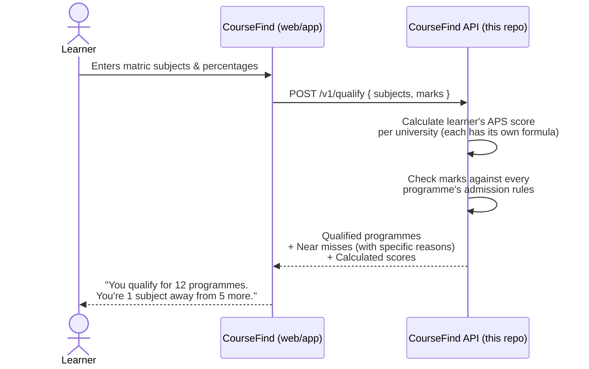

# CourseFind Data

**CourseFind answers one question for a South African matric learner: "which university programmes do I actually qualify for, right now, with the marks I have?"**

You type in your subjects and percentages. CourseFind checks them against every university programme it knows about and tells you exactly which ones you qualify for — and for the ones you *just* miss, exactly what's holding you back (e.g. "you need Mathematics level 5, you have level 4").

This repository is the data and API side of CourseFind: the service that does the checking, the admission-rules data it checks against, and the pipeline that turns real university prospectus PDFs into that data.

---

## How it works (user flow)



The API itself is intentionally simple: on startup it loads the full programme dataset into memory once, and every request after that is pure in-memory checking — no database calls per request, which is why it can answer instantly even when checking thousands of programmes.

The harder problem — *getting* accurate admission-requirement data out of real university prospectus PDFs in the first place — is what the `extract/` pipeline (below) is for.

---

## Tech stack

| Layer | Technology | Why |
|---|---|---|
| API service | **FastAPI** + **Pydantic v2**, Python 3.12 | Fast to write, validates data automatically, great for a small JSON API |
| Server | **uvicorn** | The actual process that runs the FastAPI app |
| Package/dependency management | **uv** | Single fast tool for Python versions, virtual envs, and dependencies (a `uv workspace` ties `api/` and the root project together) |
| Database (source of truth) | **Supabase** (hosted Postgres) | Where verified programme data lives before being exported to the API's flat file |
| File/blob storage | **Cloudflare R2** | Stores the original prospectus PDFs the data was extracted from |
| PDF extraction | **pdfplumber** | Reads real prospectus PDFs to find admission-requirement tables |
| AI-assisted extraction (fallback only) | AI Studio (Gemini) / OpenRouter / Z.ai (GLM) | Used only for the small number of pages two independent extraction methods disagree on — not the primary extraction path |
| Testing | **pytest** | Both the API and the extraction pipeline have their own test suites |
| Containerisation | **Docker** | The API ships as a container image |
| Deployment target | **Kubernetes** (`k8s/`, developed against a local **k3d** cluster) | Runs the API with health checks, resource limits, and horizontal scaling |

---

## Folder structure

<details>
<summary><strong>Click to expand the full folder layout</strong></summary>

```
coursefind-data/
├── api/                        # The live FastAPI service (what actually runs in production)
│   ├── src/app/
│   │   ├── main.py             # Web layer: routes, request/response shapes
│   │   ├── evaluator.py        # Core logic: does a learner meet ONE requirement?
│   │   ├── qualify.py          # Picks the right APS threshold for a learner
│   │   ├── scoring.py          # Per-university APS scoring formulas
│   │   ├── subjects.py         # Fixed list of matric subjects + level conversion
│   │   └── data/
│   │       └── programmes.json # The exported dataset the API loads at startup
│   ├── tests/                  # API test suite
│   └── Dockerfile
│
├── extract/                    # Offline pipeline: turns prospectus PDFs into programme data
│   ├── methods/                # Three independent extraction methods (voted against each other)
│   │   ├── textlayer.py        # Method A — PDF text-position based
│   │   ├── geometric.py        # Method B — pdfplumber's own table detection
│   │   └── vision.py           # Method C — AI vision model (only for disputed pages)
│   ├── institutions/           # Per-university layout profiles (registry.json)
│   ├── classify.py             # Decides which PDF pages are actually programme tables
│   ├── reconcile.py            # Merges the three methods' results, flags disagreements
│   ├── selftest.py             # The extraction "gate" — checks accuracy against hand-verified data
│   └── pipeline.py             # Ties the above together for a real ingestion run
│
├── scripts/                    # One-off / operational CLI tools
│   ├── load_seeds.py           # Loads hand-verified seed data into the database
│   ├── export_data.py          # Exports database → api/src/app/data/programmes.json
│   ├── validate_seeds.py       # Checks seed files are well-formed before loading
│   ├── triage_prospectus.py    # Quick check: is a downloaded PDF a real, full prospectus?
│   └── discover_prospectuses.py / fetch_prospectuses.py  # Finds and downloads source PDFs
│
├── seeds/                      # Hand-verified, ground-truth admission data (one JSON per faculty)
│   └── uj/                     # University of Johannesburg — the first fully verified institution
│
├── tests/                      # Tests for the extraction pipeline (not the API — see api/tests)
│
├── supabase/                   # Database schema/migrations for the local & hosted Supabase project
├── k8s/                        # Kubernetes manifests (deployment, service, autoscaling)
├── data/                       # Local working data: downloaded PDFs, discovery results (gitignored)
├── universities/               # Hand-collected reference PDFs by year
└── docs/                       # Supporting notes (e.g. scoring-method write-ups per university)
```

</details>

---

## Environment variables

<details>
<summary><strong>Click to expand</strong></summary>

### Running the API

| Variable | Required? | Purpose |
|---|---|---|
| `PROGRAMMES_DATA_PATH` | No — defaults to the bundled `data/programmes.json` | Overrides where the API loads programme data from (useful for testing against a different dataset) |
| `DATA_VERSION` | No — defaults to `"unknown"` | Stamped into every response's `X-Data-Version` header; set at Docker build time so you can tell which dataset a running container is serving |

### Running the extraction pipeline / data tooling

| Variable | Purpose |
|---|---|
| `DATABASE_URL` | Postgres connection string (Supabase) — where verified programme data is stored and loaded from |
| `R2_ACCOUNT_ID`, `R2_ACCESS_KEY_ID`, `R2_SECRET_ACCESS_KEY`, `R2_BUCKET`, `R2_ENDPOINT` | Cloudflare R2 credentials — where source prospectus PDFs are stored |
| `VISION_PROVIDER` | Which AI vision provider to use for disputed-page extraction: `aistudio` (default), `openrouter`, or `zai` |
| `OPENROUTER_API_KEY` / `OPENROUTER_MODEL` | Credentials/model when `VISION_PROVIDER=openrouter` |
| `AISTUDIO_MODEL` | Model override when using the default AI Studio (Gemini) provider |
| `ZAI_API_KEY` / `ZAI_MODEL` | Credentials/model when `VISION_PROVIDER=zai` |

None of the extraction-pipeline variables are needed to run the API itself — the API only ever reads the already-exported `programmes.json` file, never the database or a PDF directly.

</details>

---

## Getting started

This project uses **[uv](https://docs.astral.sh/uv/)** to manage everything — you don't need to separately install Python packages by hand.

```bash
# Install dependencies for the whole workspace (api/ + the data tooling)
uv sync

# Run the API locally
cd api
uv run uvicorn app.main:app --reload
# → http://127.0.0.1:8000/v1/meta

# Run the API's test suite
uv run pytest

# Run the extraction pipeline's test suite (from the repo root)
cd ..
uv run pytest
```

## Project status

The API and its admission-rules engine are fully built and tested. The dataset currently covers one institution (University of Johannesburg) with hand-verified admission requirements; the `extract/` pipeline that turns further prospectuses into data is under active development, gated behind an accuracy check (`extract/selftest.py`) before any new institution's data is trusted.
